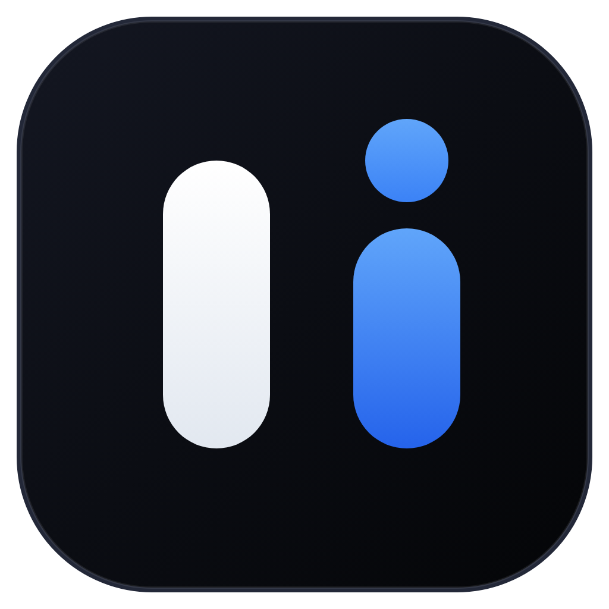

# Lumora ⚡
### AI-Powered Kanban Workspace & Autonomous Engineering Pipeline

<p align="center">
  
</p>

<p align="center">
  <b>Plan, track, diagnose, and execute software projects at lightspeed.</b><br/>
  An offline-first, high-contrast Kanban desktop workspace with integrated AI copilots, autonomous Codex dev pipelines, and 2-way issue sync for Jira, Linear, Asana, and GitHub.
</p>

<p align="center">
  <a href="https://github.com/mxyxyz9/lumora/releases"></a>
  
  
  
</p>

---

## 🌟 Key Highlights

### 🎯 1. Notion-Grade Aesthetic & Custom Project Emojis
- **Adaptive High-Contrast Themes**: Curated Obsidian, Sleek Dark, Pure Light, and OLED themes with dynamic theme-adaptive branding.
- **Distinct Project Identifiers**: Assign customized emojis (`🎯`, `🚀`, `💻`, `⚡`, `📦`, `🎨`, `💡`) to easily differentiate between active repositories and task boards.
- **Collapsible Sidebar Dock (68px)**: Collapse the navigation panel into a clean icon dock with centered project emojis and quick-switcher dropdown.

### 🤖 2. Autonomous Codex ACP Dev Pipeline & Multimodal AI
- **Automated Root-Cause Diagnosis**: Analyzes card specs, local repository files, and reproduction steps using Codex ACP.
- **Multi-Model AI Copilot**: Generate acceptance criteria, technical task breakdowns, and test plans with automatic fallback between Codex ACP and Google Gemini.
- **Automated Worktrees & Quality Gates**: Create isolated git worktrees, inspect live diffs, and run test suites before merging.

### 🗂️ 3. Multi-Subfolder Workstreams & Milestones
- **Workstream Segmentation**: Divide complex boards into organized subfolders (e.g. *Frontend Core*, *API Services*, *DevOps & Infra*) with independent swimlanes and metrics.
- **Calendar & Timeline View**: Visualize sprint deliverables and critical deadlines with dynamic status badges (`overdue`, `today`, `due soon`).

### 🔄 4. Bidirectional 2-Way Issue Sync
- Seamlessly synchronize tasks and updates with **GitHub Issues**, **Jira Cloud / Server**, **Linear**, and **Asana**.

### 🔒 5. Privacy-Preserving Offline-First Architecture & Safety
- **Zero-Config Instant Launch**: Works out-of-the-box in local offline mode backed by persistent local storage and embedded SQLite/FerretDB.
- **Accidental Exit Protection**: Built-in "Confirm Before Quitting" prompt with `Cmd+Q` interception and configurable settings.
- **Intuitive Task Management**: One-click hover task deletion with confirmation modals and dedicated danger-zone controls.

---

## 🏗️ Architecture Overview

```
lumora/
├── desktop/                      # Standalone Electron Desktop Application
│   ├── src/
│   │   ├── main/                 # Electron main process (IPC handlers, menu, quit intercept)
│   │   ├── preload/              # Secure contextBridge API bindings
│   │   └── renderer/             # React 19 + TypeScript + Vite UI
│   │       ├── components/       # BoardView, KanbanCard, CardDetailModal, SettingsView...
│   │       ├── store/            # Central Zustand reactive state & localStorage sync
│   │       ├── lib/              # AI Service, Jira/Linear/GitHub sync, Codex ACP client
│   │       └── index.css         # Modern design tokens, themes, and micro-animations
│   ├── tests/                    # Vitest automated test suites (35+ unit & integration tests)
│   └── electron-builder.yml      # macOS DMG and cross-platform packaging config
├── docs/                         # Extended architecture and security documentation
└── README.md                     # Project documentation & overview
```

---

## 🚀 Quickstart & Development Guide

### Prerequisites
- **Node.js**: `v20.x` or `v22.x`
- **npm**: `v10.x+` (or `bun`)

### 1. Clone & Install Dependencies
```bash
git clone https://github.com/mxyxyz9/lumora.git
cd lumora/desktop
npm install
```

### 2. Run in Development Mode
Launch Vite dev server with hot reload and Electron desktop window:
```bash
npm run dev
```

### 3. Run Automated Tests
Execute the complete Vitest test suite:
```bash
npm test
```

### 4. Build Native macOS DMG Installer
Package a production-ready Apple Silicon DMG installer:
```bash
npm run build
npm run build:electron
npx electron-builder --mac dmg --config electron-builder.yml
```
The resulting `.dmg` file will be generated in `desktop/release/Lumora-1.0.0-Mac-arm64.dmg`.

---

## 🙏 Acknowledgements & Inspiration

Lumora stands on the shoulders of remarkable open-source projects and developer tools:

1. **[WeKan](https://github.com/wekan/wekan)** ([wekan.fi](https://wekan.fi)) — For pioneering open-source collaborative Kanban architectures, flexible board schemas, and decades of community dedication led by Lauri Ojansivu (xet7).
2. **[Notion](https://notion.so)** — For inspiring the modern aesthetic: clean typography, inline property pills, hero headers, and distraction-free task modal workflows.
3. **[Atlassian Pragmatic Drag and Drop](https://atlassian.design/components/pragmatic-drag-and-drop)** — For providing the underlying foundation for 60fps drag-and-drop reordering.
4. **[Codex Agent Control Protocol (ACP)](https://github.com/features/copilot)** & **[Google Gemini](https://ai.google.dev/)** — For powering the autonomous developer pipelines, code diagnostics, and multimodal AI copilots.
5. **[Electron](https://www.electronjs.org/) & [Vite](https://vite.dev/)** — For providing a fast, secure, and modern cross-platform desktop runtime.

---

## 📜 License

This project is licensed under the **MIT License** — see the [LICENSE](LICENSE) file for details.
